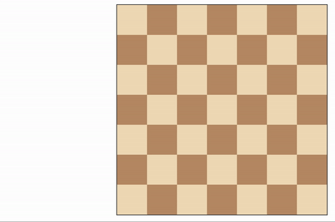

# Isolation
## Projekt pri predmetu Programiranje 2
Avtorja: Primož Durcik in Jan Lampič

[Isolation](https://en.wikipedia.org/wiki/Isolation_(board_game)) je igra med dvema igralcema, kjer igralca premikata svojo figuro. Začne beli igralec, figuri pa premikata kot konja pri šahu. Začetna položaja igralcev sta določena naključno. Kadarkoli igralec zasede polje, se to polje za preostanek igre blokira in na njega ni več možno postaviti figure. Prvi igralec, ki nima več možnih potez, izgubi in nasprotnik je razglašen za zmagovalca.

Začetna igra je nastavljena na igro med človekom (beli) in računalnikom (črni).

Izbiramo lahko med več težavnostmi. Željeno težavnost izberemo tako, da jo izberemo v zavihku "Težavnost igre" in nato izberemo željeno obliko igre (npr. "Računalnik - človek").

Primer odigrane igre:

